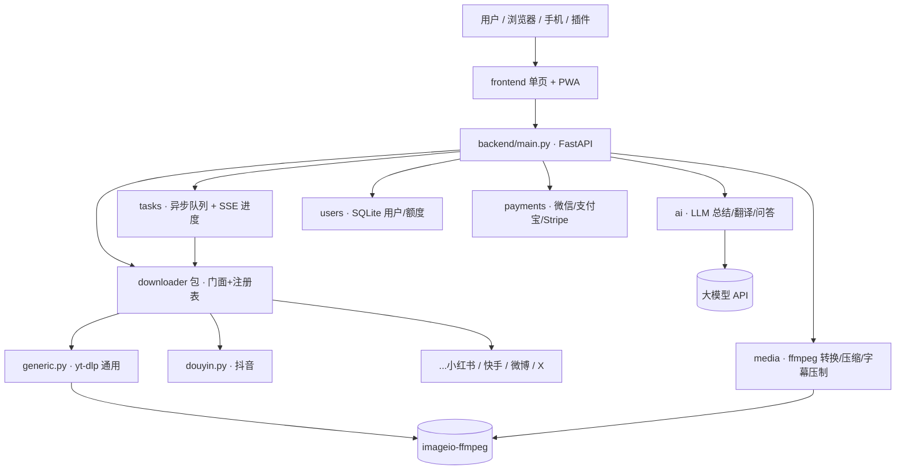
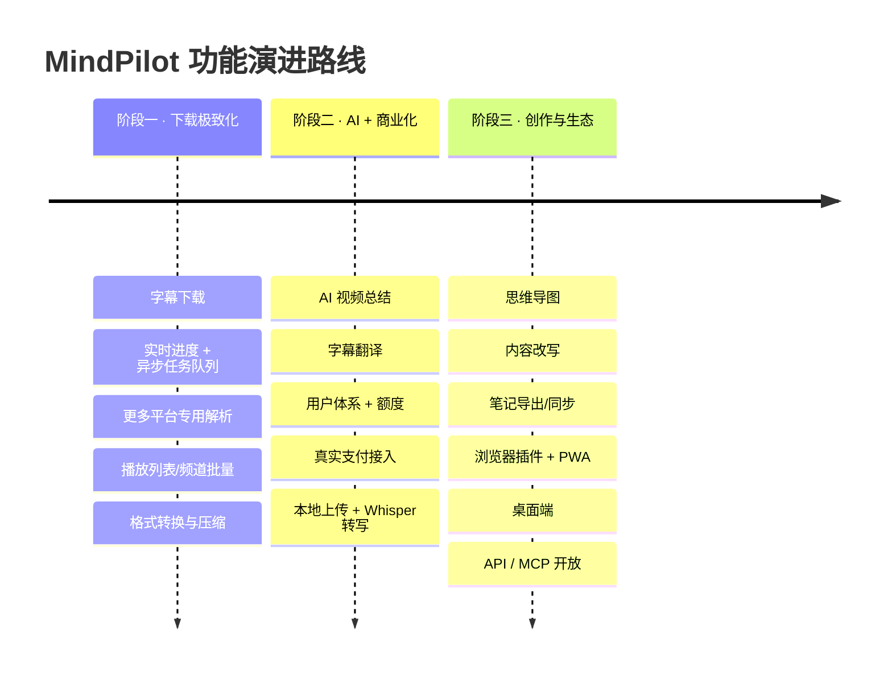

# MindPilot 竞品分析与功能规划

| 项目 | 内容 |
|------|------|
| 文档版本 | v1.0 |
| 更新日期 | 2026-09-21 |
| 文档类型 | 竞品分析 / 产品功能规划 |
| 对标竞品 | BibiGPT（https://app.bibigpt.co/ ，原 BiliGPT / AI 课代表） |
| 当前产品 | MindPilot 万能视频下载（FastAPI + yt-dlp + Tailwind） |
| 状态 | 待评审 |

---

## 一、文档说明

### 1.1 目的
1. 系统拆解竞品 **BibiGPT** 的产品定位、功能矩阵、多端生态与商业模式；
2. 盘点 **MindPilot** 当前已实现的能力与技术架构；
3. 对比二者差距，规划 MindPilot **下一步可实现的功能**，并给出结合现有架构的技术可行性、优先级与路线图。

### 1.2 结论速览（TL;DR）
- **定位差异**：BibiGPT 的核心是「**AI 音视频理解**」（总结 / 字幕 / 思维导图 / 对话 / 改写 / 笔记同步）；MindPilot 的核心是「**万能视频下载**」。二者不是同一赛道，但 BibiGPT 的能力图谱恰好指明了 MindPilot 的**纵向延伸方向**。
- **短期策略（护城河）**：先把「下载」这件事做到极致——**字幕下载、实时进度、更多平台专用解析、播放列表批量、格式转换、异步任务队列**，成本低、复用现有架构、直接强化主业。
- **中期策略（对标竞品）**：引入 **AI 总结 / 字幕翻译 / AI 问答**，从「下载工具」升级为「下载 + 理解」，并落地**用户体系 + 额度 + 真实支付**完成商业化闭环。
- **长期策略（生态）**：内容改写、思维导图、笔记导出、Whisper 语音转写、浏览器插件 / PWA / 桌面端 / API-MCP。
- **一句话**：**先做「最强下载器」，再做「下载 + AI 理解」，最后做「内容生产力生态」。**

---

## 二、竞品分析：BibiGPT

### 2.1 产品定位
> AI 音视频知行助理 —— 把 B站 / YouTube / 播客 / 会议等任意音视频内容，一键变成可搜索、可引用、可二次创作的知识产物。

- 面向人群：职场人、自媒体、教师、学生、内容创作者。
- 核心交互：粘贴链接或上传本地文件 → 30 秒内得到「带时间戳的结构化总结 + 全文转写 + 思维导图 + 可对话知识库」。
- 规模：官方称累计服务 100 万+ 用户、总结 500 万+ 视频、支持 30+ 平台。
- 运营主体：EvergreenAI Inc.，创始人吕立青（JimmyLv，前 ThoughtWorks / 阿里工程师）。

### 2.2 核心功能矩阵

| 功能域 | 具体能力 |
|--------|----------|
| 内容获取 | 链接解析（30+ 平台）、本地文件上传（mp3/mp4/m4a/wav/srt/vtt）、网盘导入（阿里云盘/百度网盘）、浏览器插件一键抓取 |
| 转写 | 全文字幕提取、语音转文字（无字幕时）、时间戳对齐、多语言识别 |
| AI 总结 | 结构化摘要、章节速览、带时间戳要点、自定义总结模板 |
| 可视化 | 思维导图、概念图谱、交互网页、演示大纲、动态网站/互动游戏 |
| AI 对话 | 基于视频内容的追问问答（RAG 召回原文作答） |
| 内容改写 | 公众号长图文、小红书卡片、推特/PPT、播客脚本、短视频脚本、分镜识别 |
| 翻译 | 字幕翻译与压制、多语言输出（中/英/日/韩/繁中） |
| 画面理解 | 视觉分析（不止音频/字幕，还分析画面） |
| 知识沉淀 | 一键同步 Notion / Obsidian / flomo / Readwise / Roam / 飞书；Markdown 导出 |

### 2.3 支持平台（30+）
哔哩哔哩、YouTube、抖音、快手、小红书、TikTok、Twitter/X、TED、Coursera、Apple Podcasts、小宇宙、Spotify、Google Podcasts、微信公众号/文章、阿里云盘、百度网盘、任意含字幕/音频的网页链接、本地音视频/字幕文件。

### 2.4 多端形态与生态
- **Web**：bibigpt.co（中文）/ aitodo.co（国际）
- **浏览器插件**：Chrome / Firefox / Edge
- **桌面端**：Windows / macOS / Linux（基于 **Tauri**，支持 winget / brew / 脚本安装）
- **移动端**：iOS / Android（基于 **Expo**）
- **微信助理**：扫码即用，转发即总结
- **Agent / MCP / API**：`bibigpt.co/api/mcp`、OpenAPI、Agent Skills（`bibi` / `bibi-library` / `bibi-feed` / `bibi-vision`），可接入 Claude Code / Cursor / ChatGPT 等

### 2.5 商业模式与定价

| 档位 | 价格 | 核心权益 |
|------|------|----------|
| 免费版 | ¥0 | 每日约 30 分钟 / 10 次额度，基础模型，最多 3 个订阅源 |
| Plus | ~$142.56/年（$11.88/月） | 本地文件 6000 分钟/月，6000 Credits/月，高级模型（GPT/Claude/Gemini），笔记同步，思维导图 |
| Pro | ~$250.56/年（$20.88/月） | Plus 全部 + 本地不限时长 + 图文改写 + 分镜识别 + 素材成片 |
| 终身 | $888 一次性 | Pro 全部 + 全部高阶模型 + 引荐返现 + 专属社群/咨询 |
| 按量 | $20(2000积分) ~ $200(40000积分) | API 客户按需充值 |

### 2.6 技术架构（据公开信息推测）
- **底层模型**：聚合多家大模型（GPT / Claude / Gemini）作为推理引擎，用户无需自管 API Key。
- **领域管线**：音视频抽取 → 字幕对齐 → 语音转写 → 中文分词 → RAG 召回 → 画面分析 → 各平台解析。
- **隐私**：上传文件 30 天自动删除、总结默认私密、宣称符合 GDPR/CCPA。

### 2.7 优势与可借鉴点
- ✅ **平台覆盖最广**（含国内 B站/小红书/抖音等海外工具难解析的来源）——MindPilot 已用 `downloader` 注册表架构对齐此思路（抖音专用解析）。
- ✅ **本地文件开箱即用**（无需先上云）。
- ✅ **端到端闭环**（获取 → 理解 → 创作 → 沉淀）。
- ✅ **多端 + Agent/MCP 生态**，分发渠道丰富。
- ⚠️ **它的短板恰是 MindPilot 的长板**：BibiGPT 主打「理解」，**「下载保存到本地」并非其核心**（它更偏向把内容转成知识产物，而非交付原始视频文件）。MindPilot 可**以「下载」为差异化护城河**，再逐步叠加理解能力。

---

## 三、MindPilot 现状盘点

### 3.1 产品定位
**万能视频下载网站**：粘贴链接，秒速解析，高速下载任意平台视频到本地；手机、电脑、平板通用；解决「平台不支持下载 / 下载不便 / 清晰度受限 / 无法批量」等痛点。

### 3.2 已实现功能

| 能力 | 说明 | 状态 |
|------|------|------|
| 视频解析 | `/api/info` 返回标题、封面、时长、清晰度列表 | ✅ |
| 视频下载 | `GET/POST /api/download`，服务端下载→流式回传→回传后清理临时文件 | ✅ |
| 清晰度选择 | 1080P/720P… 自由选择；ffmpeg 合并 DASH 分离流 | ✅ |
| 仅音频提取 | 下载最佳音轨（m4a/mp3） | ✅ |
| 批量下载 | 前端多链接逐条解析下载 | ✅ |
| 抖音专用解析 | 分享链 302 取 video_id → iteminfo API → `playwm` 换 `play` 去水印 → 失效回退 `_ROUTER_DATA` | ✅ |
| 通用解析 | 基于 yt-dlp，覆盖 B站/YouTube 等 1000+ 站点 | ✅ |
| 移动端适配 | 响应式单页，浏览器直接下载到本地 | ✅ |
| 付费 UI 占位 | Free/Pro/Team 三档 + 支付弹窗（未接真实支付） | 🟡 占位 |

### 3.3 技术架构
```
backend/                     # FastAPI 后端
├── main.py                  # 入口 + 路由（/api/health, /api/info, /api/download）
└── downloader/              # 解析下载包（门面 + 注册表 + 平台模块）
    ├── __init__.py          # 门面/调度器：按 can_handle 路由，未命中回退 generic
    ├── registry.py          # 专用解析器注册表 SPECIFIC_EXTRACTORS
    ├── common.py            # 共享：DOWNLOAD_DIR / ffmpeg 探测 / 文件名清洗
    ├── generic.py           # 通用解析器（yt-dlp 封装）
    └── douyin.py            # 抖音专用解析器
frontend/                    # Tailwind CDN 单页（index.html/app.js/styles.css）
tests/                       # test_smoke / test_e2e / test_douyin
```
- **无数据库**、无 Node 构建、轻量部署；下载采用「临时目录 → FileResponse 流式回传 → BackgroundTask 清理」。
- **可扩展性已就位**：新增平台只需加 `<platform>.py`（实现 `can_handle/extract_info/download`）并在 `registry` 注册，门面自动分发。

### 3.4 与 BibiGPT 的定位差异

| 维度 | MindPilot（现状） | BibiGPT |
|------|-------------------|---------|
| 核心价值 | **下载原始视频/音频到本地** | AI 理解与知识产物 |
| 交付物 | 视频文件（mp4/mp3） | 总结/字幕/导图/文章 |
| AI 能力 | 无 | 总结/对话/改写/翻译/视觉 |
| 平台覆盖 | yt-dlp 1000+ 站 + 抖音专用 | 30+ 平台 |
| 多端 | 响应式 Web | Web/插件/桌面/移动/微信/MCP |
| 商业化 | 付费 UI 占位 | 成熟订阅 + 按量 |
| 存储 | 无数据库、不落地用户内容 | 云端知识库、笔记同步 |

---

## 四、功能差距对比

以 BibiGPT 为参照，MindPilot 的能力缺口与机会：

| 能力 | MindPilot | BibiGPT | 差距/机会 |
|------|:---------:|:-------:|-----------|
| 视频下载（原始文件） | ✅ 强 | ⚠️ 非核心 | **MindPilot 护城河** |
| 多平台解析 | ✅ | ✅ | 可继续扩平台专用解析 |
| 字幕下载（SRT/VTT） | ❌ | ✅ | **P0 低成本补齐** |
| 实时下载进度 | ❌ | — | **P0 体验关键** |
| 播放列表/频道批量 | ❌ | 🟡 | P0 |
| 格式转换/压缩 | ❌ | 🟡 | P0（ffmpeg 已具备） |
| 本地文件上传处理 | ❌ | ✅ | P1 |
| AI 总结 | ❌ | ✅ | P1（对标核心） |
| 字幕翻译 | ❌ | ✅ | P1（需求已预留） |
| AI 问答（RAG） | ❌ | ✅ | P1/P2 |
| 思维导图 | ❌ | ✅ | P2 |
| 内容改写 | ❌ | ✅ | P2 |
| 笔记导出/同步 | ❌ | ✅ | P2 |
| 用户体系/额度 | ❌ | ✅ | P1（商业化前提） |
| 真实支付 | 🟡 占位 | ✅ | P1 |
| 浏览器插件/PWA/桌面 | ❌ | ✅ | P2 |
| API / MCP 开放 | ❌ | ✅ | P2 |

---

## 五、可实现功能规划（核心）

### 5.1 规划原则
1. **复用现有架构**：优先利用已就位的 `downloader` 注册表、`common`（ffmpeg/临时目录）、yt-dlp 能力，最小改动。
2. **轻量优先**：延续「无重型依赖、易部署」；确需存储时用 **SQLite（单文件、零运维）**，而非重型数据库。
3. **主业优先**：先极致化「下载」，再叠加「AI 理解」，避免过早分散。
4. **成本可控**：AI 功能按量计费 + 缓存 + 免费额度限制，防止 LLM 成本失控。
5. **合规底线**：仅下载用户有权内容（前端已有免责声明）；不长期存储用户内容。

### 5.2 P0 · 近期（强化下载主业，低成本高价值）

| 功能 | 用户价值 | 技术可行性 | 实现要点 | 成本 |
|------|----------|-----------|----------|------|
| **字幕下载** | 下载 SRT/VTT/ASS 字幕，或嵌入视频 | ⭐⭐⭐ yt-dlp 原生支持 | `writesubtitles`/`writeautomaticsub`/`subtitleslangs`；新增 `/api/subtitles`；抖音需专用处理 | 极低 |
| **实时下载进度** | 显示速度/百分比/剩余时间，体验质变 | ⭐⭐ 需异步化 | yt-dlp `progress_hooks` → SSE/WebSocket 推送前端 | 低 |
| **异步任务队列** | 批量/大文件不阻塞、可并发 | ⭐⭐ | 轻量内存队列 + worker 线程；任务状态查询接口 | 低 |
| **更多平台专用解析** | 小红书/快手/微博/Instagram/X 去水印下载 | ⭐⭐⭐ 复用 registry | 按 `douyin.py` 范式新增 `<platform>.py` + 注册 | 低-中 |
| **播放列表/频道批量** | 一键下载整个合集/频道/播放列表 | ⭐⭐⭐ yt-dlp 原生 | 放开 `noplaylist`，新增列表解析接口 + 前端多选 | 低 |
| **格式转换/压缩** | mp4→mp3、压缩体积、裁剪片段、转 GIF | ⭐⭐⭐ ffmpeg 已具备 | yt-dlp postprocessor 或直接 ffmpeg 命令 | 低 |
| **封面/元数据下载** | 下载封面图、标题/简介等元信息 | ⭐⭐⭐ | 已有 thumbnail 字段，补下载与 `.info.json` | 极低 |
| **下载历史（本地）** | 记录近期下载，快速重下 | ⭐⭐ | 浏览器 localStorage 或 SQLite 轻量记录 | 极低 |

**P0 关键功能详述**

- **字幕下载**：yt-dlp 已内置字幕能力，几乎零成本。可在解析结果里增加「字幕」区块，列出可用语言，支持「下载字幕文件」或「压制进视频」（`--embed-subs`，需 ffmpeg，已具备）。这是 BibiGPT 的基础能力，也是很多下载用户的刚需。
- **实时进度 + 任务队列**：当前是「同步下载完再回传」，大文件/批量时前端无反馈且阻塞。改造为：提交下载 → 返回 `task_id` → yt-dlp `progress_hooks` 更新进度 → 前端用 **SSE（Server-Sent Events）** 订阅进度 → 完成后触发浏览器下载。这是从「能用」到「好用」的关键一跃，也为后续 AI 异步任务打基础。
- **更多平台**：`downloader` 注册表架构就是为此设计的。小红书、快手、微博、Instagram、Twitter/X 等可参照 `douyin.py` 逐个补齐（去水印/直链解析），每加一个平台都是一次差异化增强。

### 5.3 P1 · 中期（引入 AI 理解 + 商业化闭环）

| 功能 | 用户价值 | 技术可行性 | 实现要点 | 成本 |
|------|----------|-----------|----------|------|
| **AI 视频总结** | 长视频秒出带时间戳要点/章节 | ⭐⭐ 需接 LLM | 字幕文本 → 新增 `backend/ai/` → 调 LLM（GPT/Claude/国产）；分段+提示词模板 | 中（LLM 调用） |
| **字幕翻译** | 中英/多语字幕互译 | ⭐⭐ | LLM 或翻译 API；可选压制双语字幕 | 中 |
| **本地文件上传** | 上传本地音视频→转写/总结 | ⭐⭐ | FastAPI `UploadFile` → ffmpeg 抽音轨 → Whisper/字幕 | 中 |
| **语音转写(Whisper)** | 无字幕视频也能出文字 | ⭐⭐ | `faster-whisper` 本地或云 API；权衡性能/成本 | 中-高 |
| **AI 问答(RAG)** | 就视频内容追问 | ⭐ 需向量检索 | 字幕分块→向量库(轻量 sqlite-vec)→检索→LLM | 高 |
| **用户体系** | 登录、额度、会员、历史 | ⭐⭐ | 引入 **SQLite** + JWT/Session；轻量够用 | 中 |
| **额度/限流** | 免费限额、付费解锁 | ⭐⭐ | 中间件计数 + 会员校验 | 低 |
| **真实支付** | 微信/支付宝/Stripe 收款 | ⭐⭐ | 对接支付 SDK + 订单/回调；替换占位弹窗 | 中 |

**P1 说明**：这是**对标 BibiGPT 的核心跨越**——从「下载工具」变为「下载 + 理解」。技术上需引入 LLM（建议抽象一个 `backend/ai/` 模块，支持多模型切换与自带 Key）。**商业化前提是先有用户体系与额度**，因此「用户体系 + 支付」应与 AI 功能同期推进，才能把 UI 占位变成真实收入。注意：需求原定「先不要数据库」，但用户/额度/订单**必须持久化**，建议演进到 **SQLite**（单文件、零运维，符合轻量原则）。

### 5.4 P2 · 远期（内容创作与生态）

| 功能 | 用户价值 | 技术可行性 | 实现要点 | 成本 |
|------|----------|-----------|----------|------|
| **思维导图** | 视频结构一图速览 | ⭐⭐ | LLM 出层级大纲 → 前端 markmap/mermaid 渲染 | 中 |
| **内容改写** | 一键出公众号/小红书/推特/短视频脚本 | ⭐⭐ | LLM + 平台化提示词模板 | 中 |
| **笔记导出/同步** | 导出 Markdown、推送 Notion/Obsidian | ⭐⭐⭐ | Markdown 导出简单；笔记 API 对接 | 低-中 |
| **浏览器插件** | 在视频页一键下载/总结 | ⭐⭐ | Chrome MV3 插件，复用后端 API | 中 |
| **PWA** | 手机「加到主屏」类 App 体验 | ⭐⭐⭐ | 前端加 manifest + Service Worker | 低 |
| **桌面端** | Win/macOS 客户端 | ⭐ | Tauri 封装现有 Web（同 BibiGPT 思路） | 中-高 |
| **API / MCP 开放** | 供开发者/Agent 调用 | ⭐⭐ | OpenAPI 已具雏形；补鉴权 + MCP endpoint | 中 |
| **多语言 i18n** | 中英日韩界面 | ⭐⭐⭐ | 前端文案字典化 | 低 |
| **深色模式** | 视觉偏好 | ⭐⭐⭐ | Tailwind dark: 变体 | 极低 |

### 5.5 工程与体验增强（贯穿各期）
- **健壮性**：解析/下载失败的分类错误码与友好提示、自动重试、平台失效降级。
- **可观测**：结构化日志、下载成功率/耗时监控、异常告警。
- **部署**：Dockerfile + docker-compose（含 ffmpeg）、环境变量配置、反向代理与 HTTPS。
- **性能**：并发限流、临时文件配额与清理、大文件分块回传。
- **安全**：接口限流防刷、SSRF 防护（校验用户提交的 URL）、上传文件类型/大小限制。

---

## 六、技术实现路径（结合现有架构）

在**不推翻现有结构**的前提下，按能力域横向扩展 `backend/`：



**建议的新增模块与依赖：**

| 模块 | 职责 | 关键依赖 |
|------|------|----------|
| `backend/downloader/` | （现有）新增各平台 `<platform>.py` | yt-dlp、requests |
| `backend/tasks/` | 异步下载任务、进度回调、SSE 推送 | `sse-starlette`、线程/asyncio 队列 |
| `backend/media/` | 转码/压缩/剪辑/字幕压制/转 GIF | ffmpeg（imageio-ffmpeg 已具备） |
| `backend/ai/` | LLM 抽象层：总结/翻译/问答，多模型可切换 | `openai`/`anthropic`/`httpx`；可选 `faster-whisper`、`sqlite-vec` |
| `backend/users/` | 用户/会话/额度/历史 | `sqlite3`（内置）、`pyjwt`/`itsdangerous` |
| `backend/payments/` | 下单/回调/会员开通 | 微信/支付宝/Stripe SDK |

**演进要点：**
1. **先异步化**：P0 的「进度 + 队列」是后续所有耗时任务（转码、AI、转写）的公共底座，优先落地。
2. **AI 层解耦**：`backend/ai/` 用统一接口封装多模型，支持「平台 Key」与「用户自带 Key」两种模式，控成本。
3. **存储渐进**：从 localStorage（前端历史）→ SQLite（用户/额度/订单）平滑过渡，不引入重型数据库。
4. **平台解析可插拔**：延续 `registry` 注册表，新增平台零改调度代码。

---

## 七、产品路线图（Roadmap）



| 阶段 | 主题 | 目标 | 关键指标 |
|------|------|------|----------|
| 一 | 下载极致化 | 做「最强下载器」，体验碾压同类 | 支持平台数、下载成功率、进度可见 |
| 二 | AI + 商业化 | 从工具变「下载+理解」，跑通收入 | 付费转化率、AI 调用量、留存 |
| 三 | 创作与生态 | 内容生产力闭环 + 多端分发 | DAU、插件安装量、API 调用量 |

---

## 八、风险与合规

1. **版权与合规**：视频下载涉及版权，须坚持「仅下载用户有权/已授权内容」，保留前端免责声明，不提供规避 DRM 的能力；AI 总结/改写产物也需注意原文版权。
2. **平台反爬与失效**：抖音/小红书等专用解析可能随平台变更失效——`registry` 架构便于快速替换单个平台模块，需建立监控与快速修复机制。
3. **LLM 成本失控**：AI 功能务必「免费额度 + 按量计费 + 结果缓存」，并支持用户自带 Key 分摊成本。
4. **带宽与存储**：下载大文件消耗服务器带宽，需限流、并发上限、临时文件配额与及时清理（现有「回传后即清」策略延续）。
5. **SSRF / 滥用**：用户提交的 URL 由服务端请求，须校验协议/域名，防内网探测与刷量。
6. **数据库演进**：引入 SQLite 后仍应保持「零运维、单文件、易备份」，避免过早复杂化。
7. **隐私**：延续「不长期存储用户下载内容与上传文件」，如需历史仅存元数据。

---

## 九、参考

- 竞品 BibiGPT：https://app.bibigpt.co/ ｜ 官网 https://bibigpt.co ｜ 功能矩阵 https://bibigpt.co/features ｜ 文档 https://docs.bibigpt.co
- 下载内核 yt-dlp：https://github.com/yt-dlp/yt-dlp （支持列表 https://github.com/yt-dlp/yt-dlp/blob/master/supportedsites.md ）
- 转码/字幕压制：ffmpeg ｜ imageio-ffmpeg（内置二进制）
- 语音转写：faster-whisper
- 桌面端：Tauri ｜ 移动端：Expo / PWA
- 原始需求：见 `docs/项目需求说明.md`

> 备注：本文档为规划建议，具体功能落地前建议逐项确认优先级与投入产出，再进入方案设计与开发。
